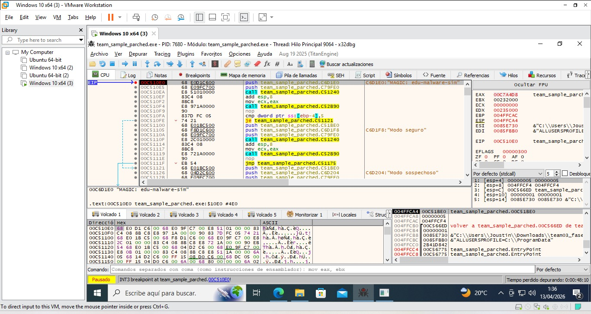
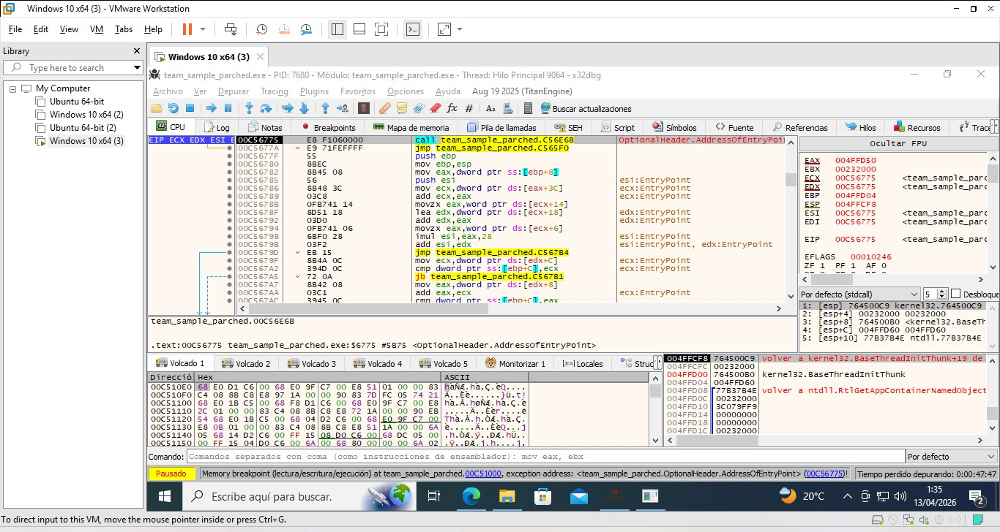

# Dynamic Debugging Report – x32dbg

## Introducción

Se realizó análisis dinámico del binario `team_sample_parched.exe` utilizando el debugger x32dbg con el objetivo de observar el comportamiento en tiempo de ejecución, identificar acceso a memoria relevante y monitorear cambios en registros durante la ejecución del programa.

---

## Breakpoint en la función principal

Se cargó el ejecutable en x32dbg y se ejecutó hasta alcanzar el Entry Point del programa.

Posteriormente se localizó la referencia a la cadena:

MAGIC: edu-malware-sim

y se colocó un breakpoint en la instrucción:

push team_sample_parched.CD1E0

Esto permitió detener la ejecución dentro del flujo principal del programa.

---

## Configuración de watchpoint sobre variable en memoria

Se configuró un memory breakpoint (watchpoint) sobre la dirección de memoria correspondiente a la cadena:

MAGIC: edu-malware-sim

Este watchpoint permitió monitorear accesos a la región de memoria donde se almacena la cadena identificadora del binario.

Durante la ejecución del programa el debugger detectó acceso a esta región, confirmando su uso activo dentro del flujo del ejecutable.

---

## Ejecución paso a paso del flujo del programa

Se utilizó la instrucción Step Over (F8) para recorrer el flujo de ejecución instrucción por instrucción dentro del programa.

Durante este proceso se identificaron llamadas a funciones internas como:

call team_sample_parched.C51240  
call team_sample_parched.C52B90

Estas instrucciones corresponden a funciones internas encargadas de procesar la lógica del programa y manipular datos en memoria.

---

## Cambios observados en registros

Durante la ejecución de las instrucciones CALL se observaron modificaciones en registros relevantes del procesador:

- EAX: utilizado como registro de retorno de funciones internas
- ECX: utilizado como argumento de entrada en llamadas a funciones
- ESP: modificado debido a operaciones sobre el stack
- EIP: actualizado conforme cambia el flujo de ejecución del programa

Estos cambios confirman la ejecución dinámica correcta del binario y la interacción con memoria interna del proceso.

---

## Activación del watchpoint durante ejecución

El watchpoint configurado previamente se activó cuando el programa accedió a la dirección de memoria asociada a la cadena MAGIC.

Esto confirma que la cadena identificadora forma parte activa del flujo de ejecución del binario.

La activación del watchpoint demuestra acceso directo a estructuras de datos relevantes durante la ejecución.

---

## Conclusión

El análisis dinámico permitió confirmar el comportamiento interno del binario mediante:

- colocación de breakpoint en flujo principal
- monitoreo de memoria con watchpoints
- ejecución paso a paso del código ensamblador
- observación de cambios en registros del procesador

Los resultados obtenidos validan el comportamiento previamente identificado durante el análisis estático y la ingeniería inversa del ejecutable.
